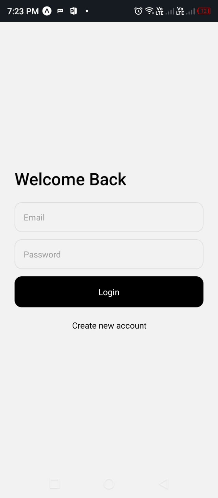
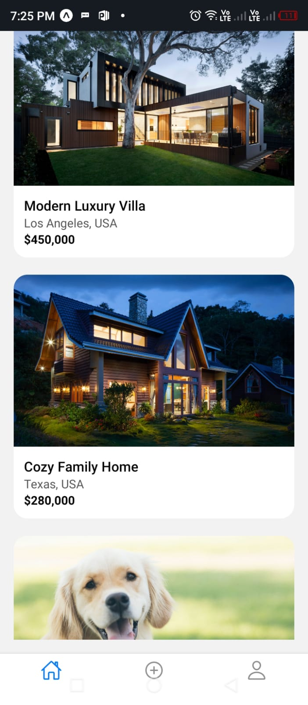
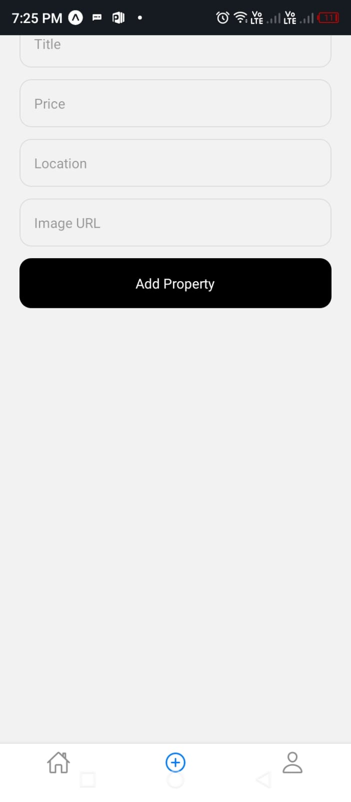
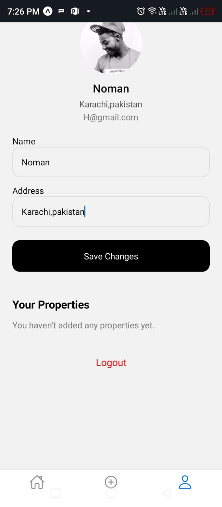
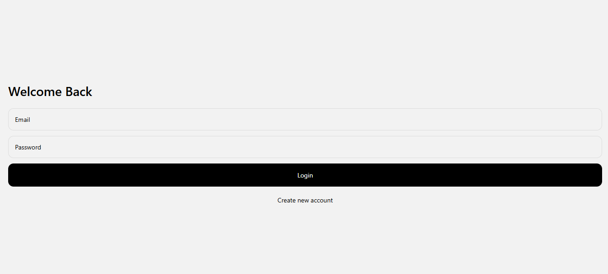
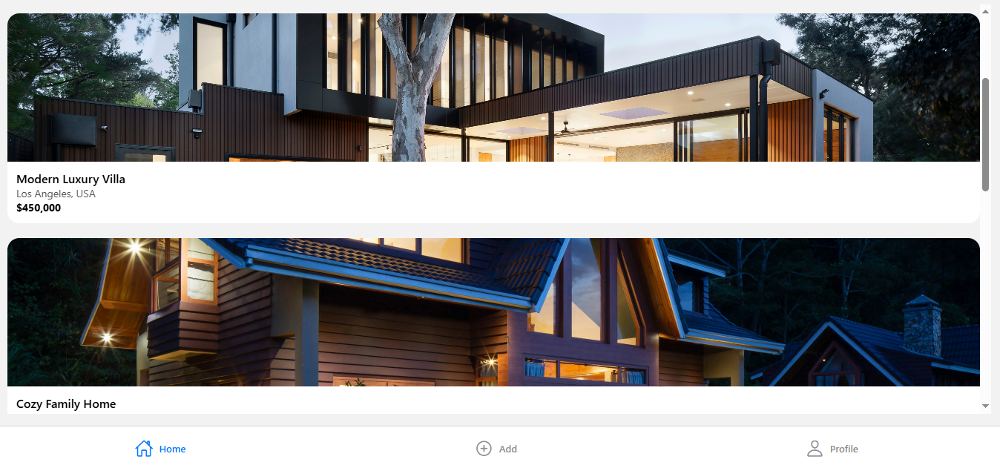
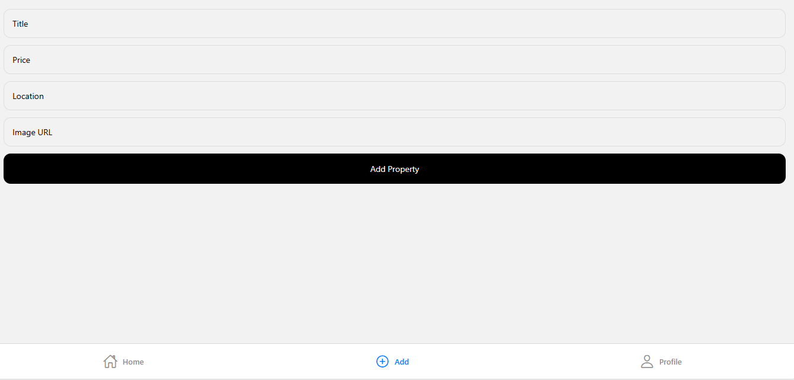
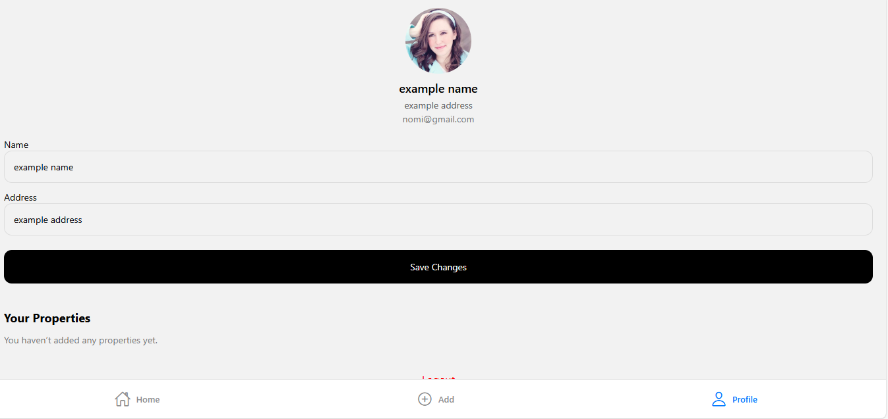

# 🏡 Real Estate App (Expo + React Native)

A **minimalistic & aesthetic real estate mobile/web app** built with **React Native (Expo)**.  
Users can sign up, log in, view properties, add their own properties, and manage their profile — all using **local storage (AsyncStorage)** with no backend.

---

## ✨ Features

- 🔐 **Authentication**
  - Signup & Login (Email + Password)
  - Data stored securely using AsyncStorage
  - Persistent login across sessions

- 🏠 **Property Listing**
  - Browse modern homes with real images
  - View property details (price, location, images, features)
  - Smooth navigation using Expo Router

- ➕ **Add Property**
  - Users can add new properties
  - Properties persist even after refresh
  - Each property is linked to the logged-in user

- 👤 **User Profile**
  - View & update name and address
  - Profile avatar
  - See **“Your Properties”** added by the user
  - Logout functionality

- 🌐 **Cross Platform**
  - Works on **Android**, **iOS**, and **Web**

---

## 📸 Screenshots mobile

## 📸 Screenshots web

